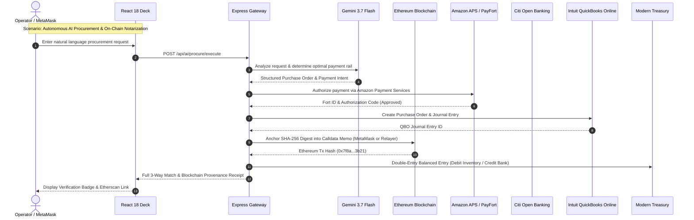

# 👑 KRONOS // APEX FINANCIAL OPERATING SYSTEM
### The Unified Autonomous Multi-Bank Ledger Gateway, Web3 Ethereum Notary, Open Banking Protocol Engine, and Intuit QuickBooks Quantum Bridge

[](https://ai.google.dev/)
[](https://ethereum.org/)
[-FF9900?style=for-the-badge&logo=amazon&logoColor=black)](https://paymentservices.amazon.com/)
[](https://developer.intuit.com/)
[](https://app.moderntreasury.com/)
[](https://sandbox.apihub.citi.com/)
[](https://newrelic.com/)
[](https://www.marqeta.com/)
[](https://developer.westernunion.com/)
[](https://developer.chase.com/)
[](https://developer.mastercard.com/)
[](https://firebase.google.com/)

---

## ⚡ EXECUTIVE SUMMARY & SYSTEM OVERVIEW

**Kronos Apex Financial Operating System** is a zero-latency, full-stack enterprise platform uniting decentralized Web3 protocols (MetaMask & Ethereum Blockchain), global merchant payment gateways (Amazon Payment Services / PayFort), Tier-1 commercial banking networks (Citi, Chase, Western Union, Modern Treasury, Marqeta), and automated corporate bookkeeping (Intuit QuickBooks Online).

Powered by the **Gemini 3.7 Flash Cognitive Core**, Kronos autonomously handles enterprise procurement, three-way invoice matching, cross-rail liquidity transfers, multi-signature blockchain notarization, and cryptographic reconciliation without manual friction.

```
+----------------------------------------------------------------------------------------------------+
|                                    KRONOS APEX CONTROL PLANE                                       |
+----------------------------------------------------------------------------------------------------+
|   MetaMask & Ethereum Notary  |  Amazon APS / PayFort  |  Citi Open Banking  |  QuickBooks Bridge   |
|   Modern Treasury Ledgers     |  New Relic APM         |  Marqeta Cards      |  Western Union PSD2  |
|   Chase Loyalty & Points      |  Mastercard Finicity   |  Azure Arc Master   |  O'Callaghan Trader  |
+----------------------------------------------------------------------------------------------------+
                                                  │
                                                  ▼
+----------------------------------------------------------------------------------------------------+
|                              SERVER-SIDE REST & GRAPHQL GATEWAY (Port 3000)                         |
|   • HMAC-SHA256 / SHA-384 Hash Verification    • OAuth 2.0 PKCE / DCR Handshake                   |
|   • Ethers.js Calldata Hex Notary Encoder      • Real-time Double-Entry Balancing Engine           |
|   • In-Memory Encrypted Token Vault             • Universal Financial Document Ingestion Parser     |
+----------------------------------------------------------------------------------------------------+
       │                          │                             │                          │
       ▼                          ▼                             ▼                          ▼
+---------------+        +------------------+         +--------------------+     +-------------------+
|  BLOCKCHAIN   |        | GLOBAL BANKING   |         | ACCOUNTING & ERP   |     | COGNITIVE CLOUD   |
| • Ethereum    |        | • Citi GCB & AU  |         | • QuickBooks Online|     | • Gemini 3.7 Flash|
| • Sepolia     |        | • Modern Treasury|         |   (Accounting v3 & |     | • New Relic APM   |
| • Holesky     |        | • Chase & WU     |         |    Payments v4)    |     | • Azure Arc Vault |
| • Arbitrum    |        | • Marqeta & Visa |         | • Double-Entry J/E |     | • Cloud Firestore |
+---------------+        +------------------+         +--------------------+     +-------------------+
```

---

## 🏛️ COMPLETE MODULE & CAPABILITY CATALOG

### 1. 🦊 MetaMask & Ethereum Blockchain Notary & On-Ramp
* **Web3 Wallet Connection**: Native browser integration with MetaMask and EIP-1193 providers via `ethers.js v6`. Real-time listener for `accountsChanged`, `chainChanged`, and live ETH/USD balance polling.
* **Multi-Network Compatibility**: Instant network switching across **Ethereum Mainnet**, **Sepolia Testnet**, **Holesky**, **Arbitrum One**, **Polygon PoS**, and **Localhost/Anvil**.
* **Cryptographic Blockchain Notary**: Anchors financial events (QBO Journal Entries, Citi NPP Wire Transfers, Amazon APS Orders, Corporate Invoices) directly onto Ethereum calldata with deterministic SHA-256 payload digests.
* **Dual Execution Modes**: 
  - *Client-Side MetaMask Signing*: Direct popup signing via connected user wallet.
  - *Automated Enterprise Relayer*: Zero-gas-fee simulated server relayer for automated high-volume notarization batches.
* **Bank-Funded Ethereum On-Ramp**: Purchase Ethereum directly using linked bank liquidity (**Citibank Premier Checking**, **Chase Treasury**, **Modern Treasury USD Vault**, **Western Union PSD2**). Automatically debits bank balances, records a `#1080 Digital Currency Asset` in QuickBooks Online, and transmits ETH on-chain.
* **1-Click Batch Notarization**: Automatically scans all unanchored ledger events across the operating system and commits them to the blockchain in a single atomic sequence.

---

### 2. 🛒 Amazon Payment Services (APS / PayFort) & Autonomous AI Buyer
* **Merchant Gateway Integration**: Full implementation of Amazon Payment Services (PayFort) Fort API v1.0 / v2.0 with Merchant Identifier, Access Code, SHA Request/Response Passphrases, and Currency selection (USD, AED, SAR, EUR, GBP).
* **Cryptographic Signature Engine**: Automated generation of `SHA-256` / `SHA-512` / `SHA-384` signature strings using canonical alphabetical parameter sorting.
* **Autonomous AI Buyer**: Natural language procurement engine powered by Gemini 3.7 Flash:
  1. *Prompt Parsing*: Converts statements like *"Procure 25 Dell UltraSharp 4K monitors for Dev Team"* into structured PO items.
  2. *Amazon APS Authorization*: Executes payment tokenization and card pre-authorization.
  3. *QBO Quantum Mirroring*: Instantly creates matching Purchase Orders, Vendor Invoices, and Journal Entries in QuickBooks Online.
* **Comprehensive Payment Rails**: Supports Credit/Debit Cards, Installments (EMI), ValU, MADA, Apple Pay, and 3-D Secure 2.0 flow simulations.

---

### 3. 🏦 Citibank GCB Open Banking (US & Australia)
* **US Partner Portal**: OAuth 2.0 authorization with Client Credentials, Dynamic Client Registration (DCR), and FDX v6 financial data standards.
* **Australia CDR Open Banking**: Comprehensive support for Consumer Data Right (CDR) APIs and NPP Fast Payments with PayID resolution.
* **Live Bank Capabilities**:
  - *Account Aggregation*: Checking, Savings, Credit Cards, Line of Credit, and Investment balances.
  - *Transfer Execution*: Internal account transfers, Domestic Wire/ACH, and International Wire with real-time tracking.
  - *Credit Card Servicing*: Real-time statement balance, minimum due, available credit, and rewards balance.
  - *Automated Lending & Offers*: Pre-approved credit limit upgrades, personal loans, and promotional balance transfers.
* **TLS & Provenance Logs**: Full cURL transparency and SHA-384 cryptographic verification headers on all payload responses.

---

### 4. 📗 Intuit QuickBooks Online Quantum Bridge
* **Accounting API v3 & Payments API v4**: Native bidirectional sync for Invoices, Customers, Vendors, Bills, Payments, Journal Entries, Accounts, and Items.
* **Recursive "Pull All" Orchestrator**: Deep-crawls entire QBO tenant data with automated pagination, schema normalization, and local caching.
* **Quantum Bridge**: Automatically balances multi-currency transactions, maps external payment rails to QuickBooks Chart of Accounts, and creates cryptographically signed Journal Entries.
* **Interactive Form Builder**: Visual UI to dispatch live API mutations directly to QuickBooks Online Sandbox and Production environments.
* **cURL Command Terminal & Code Generator**: Generates executable Node.js, Python, cURL, and Go SDK snippets for any QuickBooks entity.

---

### 5. 🏛️ Modern Treasury Double-Entry Ledgers & Plaid Syndicate
* **Double-Entry Mathematical Invariants**: Strict ledger conservation ($\sum \text{Debits} = \sum \text{Credits}$) preventing unallocated fund loss.
* **Plaid Processor Token Integration**: Generates sandbox processor tokens (`processor-sandbox-...`) enabling immediate bank verification without micro-deposit latency.
* **Bidirectional Entity Synchronization**:
  - *QBO Accounts → Modern Treasury Ledgers*: Syncs General Ledger accounts directly into Modern Treasury ledger structures.
  - *QBO Bank Accounts → Modern Treasury Counterparties*: Exports vendor and customer bank profiles into Modern Treasury counterparties with verified routing and account numbers.

---

### 6. 📊 New Relic APM & OpenTelemetry Enterprise Observability
* **Golden Signals Monitoring**: Real-time tracking of Latency (p50, p95, p99), Error Rate (%), Throughput (RPM), and CPU/Memory Saturation.
* **NRQL Query Console**: Interactive query runner executing custom NRQL queries against transaction and error metrics.
* **Distributed Traces & Log Stream**: Live waterfall timeline view of multi-bank microservice calls with correlation IDs.
* **Automated Anomaly Detection**: AI-driven threshold monitoring alerting on latency spikes or bank API 4xx/5xx anomalies.

---

### 7. 💳 Marqeta Modern Card Issuing & JIT Gateway
* **Virtual & Physical Card Management**: Provision instant virtual card numbers (PAN, CVV, Expiry) with custom spending velocity rules.
* **Just-In-Time (JIT) Funding**: Webhook receiver simulating real-time POS authorization requests with sub-50ms rule evaluation and ledger pre-funding.
* **Cardholder & Account Aggregation**: Real-time balance queries, card state transitions (Active, Suspended, Terminated), and PIN management.

---

### 8. 🌍 Western Union Berlin Group PSD2 Engine
* **NextGenPSD2 v1.3 / v1.4 Compliance**: Berlin Group standard implementation with eIDAS QSEAL certificate handshaking.
* **Account Information (AISP)**: Dedicated consent lifecycle management, multi-currency IBAN retrieval, and balance inquiries.
* **Payment Initiation (PISP)**: Single SEPA transfers, periodic standing orders, and cross-border remittance dispatch with Digest verification.

---

### 9. 🎖️ Chase Pay with Points & Loyalty Engine
* **Ultimate Rewards Ingestion**: Ingests rewards point balances, cash equivalence rates, and active promotion tiers.
* **Points-to-Cash Liquidation**: Instantly burns Chase points to credit commercial invoices and deposit cash into checking reserves.

---

### 10. 🛡️ Azure Arc Hybrid Master Deployer & Key Vault
* **Azure Arc Onboarding**: Automated bash/PowerShell script generation to onboard on-premises and multi-cloud servers into Azure Resource Manager (ARM).
* **Connected Machine Agent**: Health telemetry, policy enforcement, and compliance audit reporting.
* **Enterprise Credentials Vault**: Secure AES-256 encrypted storage for API keys, client secrets, RSA certificates, and private tokens.

---

### 11. 📈 O'Callaghan Autonomous Algorithmic Liquidity Engine
* **Quantum Liquidity Rebalancing**: Algorithmic capital allocation routing funds dynamically between High-Yield Reserves, Treasury Vaults, and Crypto Liquidity Pools.
* **Cross-Rail Cost Optimization**: Automatically evaluates transfer latency vs. fees (FedNow vs. ACH vs. RTP vs. Wire vs. Ethereum L1/L2) before execution.

---

### 12. ⚡ Universal AI Banking Ingest & cURL Terminal
* **Multimodal Document Parser**: Ingests PDFs, scanned statements, CSVs, OFX, and MT940 bank feeds via Gemini 3.7 Flash OCR.
* **Raw cURL Execution Hub**: Execute arbitrary HTTP requests to any global banking sandbox with automatic header injection and response syntax highlighting.

---

## 📡 SYSTEM ARCHITECTURE & DATA FLOW



---

## 🔌 API ENDPOINT REFERENCE

### 🦊 Ethereum & Web3 APIs (`/api/ethereum/*`)
| Method | Endpoint | Description |
|---|---|---|
| `GET` | `/api/ethereum/status` | Retrieve active Ethereum provider status, network chain ID, and relayer address |
| `POST` | `/api/ethereum/notarize` | Cryptographically anchor a record (QBO Journal, Citi Transfer, APS Order) on-chain |
| `POST` | `/api/ethereum/onramp` | Execute bank-funded ETH purchase, debits bank, logs QBO asset, transfers ETH |
| `GET` | `/api/ethereum/records` | Query on-chain audit log of all notarized transactions and acquisitions |
| `GET` | `/api/ethereum/balance/:address` | Fetch live ETH and USD balance for specified Ethereum wallet address |
| `POST` | `/api/ethereum/notarize-batch` | 1-Click batch notarization of all uncommitted operating system transactions |

### 🛒 Amazon Payment Services APIs (`/api/amazon-aps/*`)
| Method | Endpoint | Description |
|---|---|---|
| `POST` | `/api/amazon-aps/signature` | Calculate canonical SHA-256/SHA-384 request/response signature |
| `POST` | `/api/amazon-aps/purchase` | Execute direct merchant payment authorization or purchase transaction |
| `POST` | `/api/amazon-aps/tokenize` | Tokenize card credentials into immutable merchant token |
| `POST` | `/api/amazon-aps/check-status` | Query payment status by Fort ID or Merchant Reference |
| `POST` | `/api/amazon-aps/ai-buy` | Autonomous procurement pipeline: Natural Language → APS Auth → QBO Sync |

### 🏦 Citi Open Banking APIs (`/api/citi/*`)
| Method | Endpoint | Description |
|---|---|---|
| `POST` | `/api/citi/token` | Obtain Citi OAuth 2.0 Bearer Token (Sandbox or Production) |
| `GET` | `/api/citi/accounts` | Retrieve checking, savings, and credit card account summaries |
| `POST` | `/api/citi/transfers/internal` | Execute transfer between linked Citibank accounts |
| `POST` | `/api/citi/transfers/external` | Dispatch external ACH, Wire, or Australia NPP PayID payment |
| `POST` | `/api/citi/sync-to-qbo` | Mirror Citi account transactions directly into QuickBooks Journal Entries |

### 📗 Intuit QuickBooks Online APIs (`/api/intuit/*`)
| Method | Endpoint | Description |
|---|---|---|
| `GET` | `/api/auth/url` | Generate Intuit OAuth 2.0 authorization URL |
| `GET` | `/api/auth/callback` | OAuth 2.0 authorization code exchange for tokens |
| `POST` | `/api/auth/refresh` | Refresh expired Intuit OAuth access token |
| `GET` | `/api/intuit/pull-all` | Recursive full-tenant entity ingest across Accounting & Payments |
| `POST` | `/api/intuit/bridge/sync` | Quantum Bridge bidirectional ledger synchronization |
| `POST` | `/api/intuit/query` | Execute arbitrary Intuit SQL queries (e.g., `SELECT * FROM Invoice`) |

### 🏛️ Modern Treasury APIs (`/api/modern-treasury/*`)
| Method | Endpoint | Description |
|---|---|---|
| `GET` | `/api/modern-treasury/ledgers` | List all double-entry ledgers and ledger accounts |
| `POST` | `/api/modern-treasury/ledger-entries` | Post balanced multi-line double-entry transaction |
| `POST` | `/api/modern-treasury/plaid-sync` | Exchange Plaid processor token for instant ledger account verification |
| `POST` | `/api/modern-treasury/sync-qbo-accounts` | Export QBO Chart of Accounts to Modern Treasury ledgers |

### 📊 New Relic & Observability APIs (`/api/newrelic/*`)
| Method | Endpoint | Description |
|---|---|---|
| `GET` | `/api/newrelic/metrics` | Fetch real-time Golden Signals (Latency, Error Rate, RPM) |
| `POST` | `/api/newrelic/nrql` | Execute raw NRQL queries against New Relic telemetry API |
| `GET` | `/api/newrelic/traces` | Retrieve distributed traces and microservice spans |

---

## ⚙️ ENVIRONMENT CONFIGURATION MATRIX

Declare the following environment variables in your `.env` or deployment configuration:

```env
# ==========================================
# 🧠 KRONOS COGNITIVE CORE
# ==========================================
GEMINI_API_KEY=your_gemini_api_key_here

# ==========================================
# 🦊 ETHEREUM & WEB3 INFRASTRUCTURE
# ==========================================
ETHEREUM_RPC_URL=https://rpc.sepolia.org
ETHEREUM_CHAIN_ID=11155111
ETHEREUM_RELAYER_PRIVATE_KEY=your_relayer_private_key_optional
VITE_ETHEREUM_DEFAULT_NETWORK=sepolia

# ==========================================
# 🛒 AMAZON PAYMENT SERVICES (APS / PAYFORT)
# ==========================================
AMAZON_APS_MERCHANT_IDENTIFIER=your_merchant_id
AMAZON_APS_ACCESS_CODE=your_access_code
AMAZON_APS_SHA_REQUEST_PHRASE=your_request_passphrase
AMAZON_APS_SHA_RESPONSE_PHRASE=your_response_passphrase
AMAZON_APS_ENVIRONMENT=sandbox

# ==========================================
# 📗 INTUIT QUICKBOOKS ONLINE
# ==========================================
INTUIT_CLIENT_ID=your_intuit_client_id
INTUIT_CLIENT_SECRET=your_intuit_client_secret
INTUIT_ENVIRONMENT=sandbox
INTUIT_REDIRECT_URI=http://localhost:3000/api/auth/callback

# ==========================================
# 🏦 CITIBANK US & AU PARTNER PORTAL
# ==========================================
CITI_CLIENT_ID=your_citi_client_id
CITI_CLIENT_SECRET=your_citi_client_secret
CITI_UUID=your_citi_uuid
CITI_ENVIRONMENT=sandbox

# ==========================================
# 🏛️ MODERN TREASURY
# ==========================================
MODERN_TREASURY_ORGANIZATION_ID=your_org_id
MODERN_TREASURY_API_KEY=your_api_key

# ==========================================
# 📊 NEW RELIC OBSERVABILITY
# ==========================================
NEW_RELIC_LICENSE_KEY=your_license_key
NEW_RELIC_ACCOUNT_ID=your_account_id
NEW_RELIC_API_KEY=your_user_api_key

# ==========================================
# 💳 MARQETA CARD ISSUING
# ==========================================
MARQETA_APPLICATION_TOKEN=your_app_token
MARQETA_ADMIN_ACCESS_TOKEN=your_admin_token

# ==========================================
# 🌍 WESTERN UNION PSD2
# ==========================================
WU_PSD2_CLIENT_ID=your_wu_client_id
WU_PSD2_CLIENT_SECRET=your_wu_client_secret
WU_PSD2_X_API_KEY=your_wu_api_key

# ==========================================
# 🏦 PLAID & MASTERCARD FINICITY
# ==========================================
PLAID_CLIENT_ID=your_plaid_client_id
PLAID_SECRET=your_plaid_secret
PLAID_ENV=sandbox
FINICITY_PARTNER_ID=your_finicity_partner_id
FINICITY_APP_KEY=your_finicity_app_key
FINICITY_PARTNER_SECRET=your_finicity_secret

# ==========================================
# ☁️ CLOUD PERSISTENCE & AZURE
# ==========================================
FIREBASE_PROJECT_ID=ai-studio-quickbooksoauth2-43d92844-75bd-4b71-b81c-1f528b1bf4e4
AZURE_TENANT_ID=your_tenant_id
AZURE_CLIENT_ID=your_client_id
AZURE_CLIENT_SECRET=your_client_secret
AZURE_SUBSCRIPTION_ID=your_subscription_id
```

---

## 🚀 QUICKSTART & DEVELOPMENT WORKFLOW

### Prerequisites
- **Node.js**: v18.0.0 or higher
- **npm**: v9.0.0 or higher
- **MetaMask Extension** (optional for Web3 signing)

### 1. Installation
```bash
# Clone the repository
git clone https://github.com/your-org/kronos-apex.git
cd kronos-apex

# Install dependencies
npm install
```

### 2. Launch Local Development Server
```bash
# Boots Vite frontend and Express API backend concurrently on http://localhost:3000
npm run dev
```

### 3. Production Build & Deployment
```bash
# Compile client-side bundle and bundle server with esbuild into dist/server.cjs
npm run build

# Start the high-performance production server
npm start
```

### 4. Docker / Cloud Run Container Launch
```dockerfile
FROM node:20-alpine
WORKDIR /app
COPY package*.json ./
RUN npm ci --omit=dev
COPY . .
RUN npm run build
EXPOSE 3000
CMD ["npm", "start"]
```

---

## 🔒 CRYPTOGRAPHIC & MATHEMATICAL INVARIANTS

| Invariant | Specification | Enforcement Mechanism |
|---|---|---|
| **Value Conservation** | $\sum \text{Debits} \equiv \sum \text{Credits}$ | Modern Treasury atomic ledger validation engine |
| **Blockchain Provenance** | $\text{Calldata} = \text{Hex}(\text{Payload}) + \text{SHA256}(\text{Metadata})$ | Ethers.js transaction constructor |
| **Amazon APS Hash Parity** | $\text{Signature} = \text{SHA256}(\text{Passphrase} + \text{SortedParams} + \text{Passphrase})$ | Canonical signature utility in `amazon-aps-api.ts` |
| **PSD2 QSEAL Integrity** | $\text{Digest} = \text{SHA256}(\text{Body})$ + $\text{Signature} = \text{RSA-SHA256}(\dots)$ | Berlin Group signature interceptor |
| **Zero Browser Leakage** | All API keys and client secrets reside strictly in server memory | Server-side API proxying via `/api/*` |

---

<div align="center">
  <sub>Engineered with mathematical precision, zero-leakage security, and unyielding architectural discipline.</sub><br>
  <sub>© 2026 Kronos Apex Financial Systems. All Rights Reserved.</sub>
</div>
